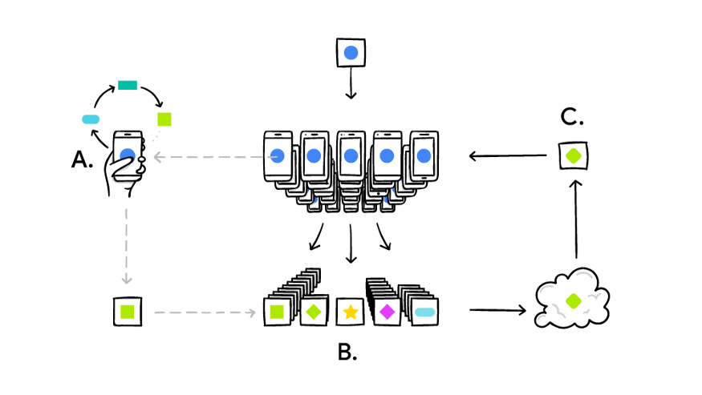
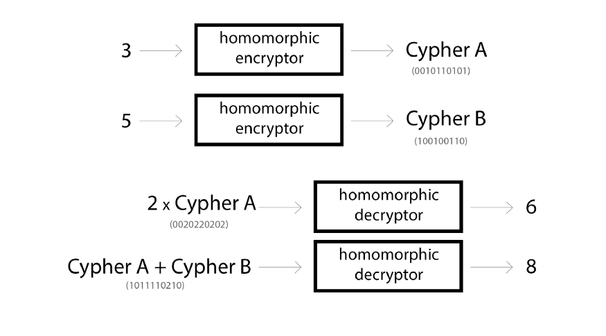

# Project Objective :   
## This project aims to achieve [federated learning](https://ai.googleblog.com/2017/04/federated-learning-collaborative.html) training of model and then testing on [encrypted dataset and model](https://iamtrask.github.io/2017/03/17/safe-ai/) using [pytorch](https://pytorch.org/) and [pysyft](https://github.com/OpenMined/PySyft).

## Dataset : MNIST 
> (Intent behind using the simple dataset is the main motive which is to combine privacy preserving techniques using pysyft)

   

## Basic overview of federated learning :   

Have you ever wondered how Google keyboard predicts the probability of the words you will type after you just start typing ?
Or how the Apple iOS detects the most correct emoji you want to use in a conversation.

   

There are similar other things where we can see the use of federated learning like :
* wearable medical devices
* predictive maintenance (automobiles / industrial engines)
* ad blockers / autotomplete in browsers (Firefox/Brave)
* app company (Texting prediction app)
* so what exactly is federated learning ?

**Federated Learning is a collaborative form of machine learning where the training process is distributed among many users and not based totally on a single server. Here , the server is the main control for coordinating everything but most of the work for training process is done by federation of users.**  

Normally , one would send all the data to a central server for training the model created on the server and then the model is trained but for some security reasons we might not want to send all of the data in the hands of some other organisations like all the things we type in daily on the phone.
So, federated learning is one of the solution , though not the only one.
In the context of federated learning process, we call the devices or a remote machine ‘workers’.
You might understand in terms like this say , you have a boss and that boss in your organisation has the main role of supervising things there but since he is the busiest due to other stuff like meetings and all , he keeps some persons who are employees working there.
These employees work for different dept. and also share some of the data with the Boss and organisation and therefore making contribution towards overall development of the company / organisation.   

    

Let’s now learn how the process actually works :
* First, the model initializes the weights on the server , by using any method like random, He, Xavier initialization.
* Then a random sampling is done to select the users to improve the model by training the model on the local datasets available on the local devices / remote machines.
* It means that the ‘workers’ can be called as real producer of the dataset on which the model actually learns.
* Then each sampled users receives the model and starts training on the local dataset and computes the model updates like new weights and gradients which are model parameters.
* All of these computations of model updates are sent back to the server and then take weighted average with respect to no of training examples that clients (devices) used.
* Then the server applies the updated model to the old model by using optimization algorithms like gradient descent or any other form.

_Now, what are the hyperparameters we are concerned with ?
The model architectures used for other learning process will remain almost same although it’s a hit and trial process but there is yet another hyperparameter called ‘communication rounds’.
Since this sending of model and getting received it back with updates from billion of users at a time is a communication channel rounds and hence , how many users are being sampled in each round influences how many rounds of communication is required until the convergence is reached._   

      

Let’s talk about challenges faced during federated learning :
* Data is distributed across millions of devices in a highly uneven fashion
* Different users could be creating different non identical distributions
* These devices have significantly higher-latency, lower-throughput connections and are only intermittently available for training.
_Now you will be wondering that while training takes place my phone performance would be impacted.
But surprisingly , nothing impacts the performance.
To understand why read this extract which is taken from Google AI blog:
“Careful scheduling ensures training happens only when the device is idle, plugged in, and on a free wireless connection, so there is no impact on the phone’s performance”_    

Now , let’s see some of the changes introduced in normal federated learning to improve the privacy and move it to next level of enhancement :
* Users are sampled randomly and not always equal , this ensures there is no bias.
* Noise is added to the final output update of the model by applying globally differentially private algorithms.
* There is new protocol for transfering data Secure Aggregation protocol which uses cryptographic techniques when decrypting the updates on the server and the server only does it when if 100s or 1000s of users have participated. No individual phone’s update can be inspected before averaging.

## Basic overview of encrypted deep learning :   

   
